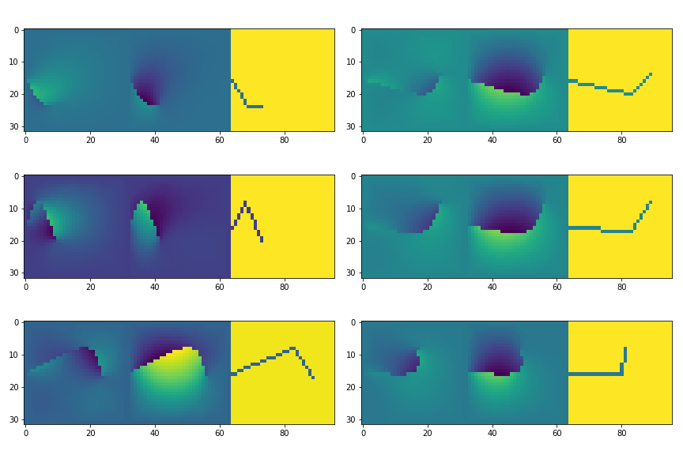

# Frature database

Alejandro Queiruga
Lawrence Berkeley Lab
2018

## Overview

Modeling the propogation of fracture is an open problem. Generalizing to various classes of materials and propagation modes is likely intractable with traditional analyses.

The hope for this database is to analyze the fine-scale displacement
and stress features around a fracture tip in a standard domain, and learn new
predictive capabilities.

There are smooth and rough fractures in homogenous and heterogenous media.

This repository contains the codes used to build the databse.
The databases themselves are published at (TODO Zenodo? DoE db?)

Multiple simulation techniques can be used to generate the images.
We don't particularly trust any of them, but we can compare them.
Analysis techniques could potentially fit through the errors by 
looking at the data generated by multiple methods.

## Methodology

The following methods are used:

1. Discretely meshed FEM (Implemented)
2. Phase-field FEM (Need to merge it in)
3. Peridynamics using [PeriFlakes](https://github.com/afqueiruga/PeriFlakes) (untrusted)

The scripts are located in this repo.

- [crack_gen.geo](crack_gen.geo) A gmsh script to mesh a discrete fracture with command line parameters.
- [fem_crack.py](fem_crack.py) Solve a fracture using FEniCS.
- [setup_fenics.sh](setup_fenics.sh) Sets up software for the vanilla FEniCS docker image.

As of this time, the setup is a pressurized fracture with the sides of the domain held clamped---imagine hydraulically fracturing a clamped laboratory sample.

## Database

The databses can be found at LINK TODO.
The database entries contain the following columns:

1. method - the method used to calculate this entry
2. h - mesh discretization
3. fracture parameters
4. strain energy
5. griffiths fracture energy
5. Fracture volume
6. raw data
7. multichannel downsampled image

The images have the following channels:

1. float - ux
2. float - uy
3. bool - fracture ( 1 fracture, 0 no fracture )
4. float - K bulk modulus (Not yet; uniform K)
5. float - G shear modulus (Not yet; uniform G)

Example entires are in [look_at_results.ipynb](look_at_results.ipynb).

The database is fed into a TensorFlow graph in [importing_in_tensorflow.ipynb](importing_in_tensorflow.ipynb) and used to train a naive model that "predicts" the strain energy from the fracture picture. 
(It's not a very good model: it's just a test.)

## License

Copyright (C) Alejandro Francisco Queiruga, Lawrence Berkeley National Lab, 2018-2019

